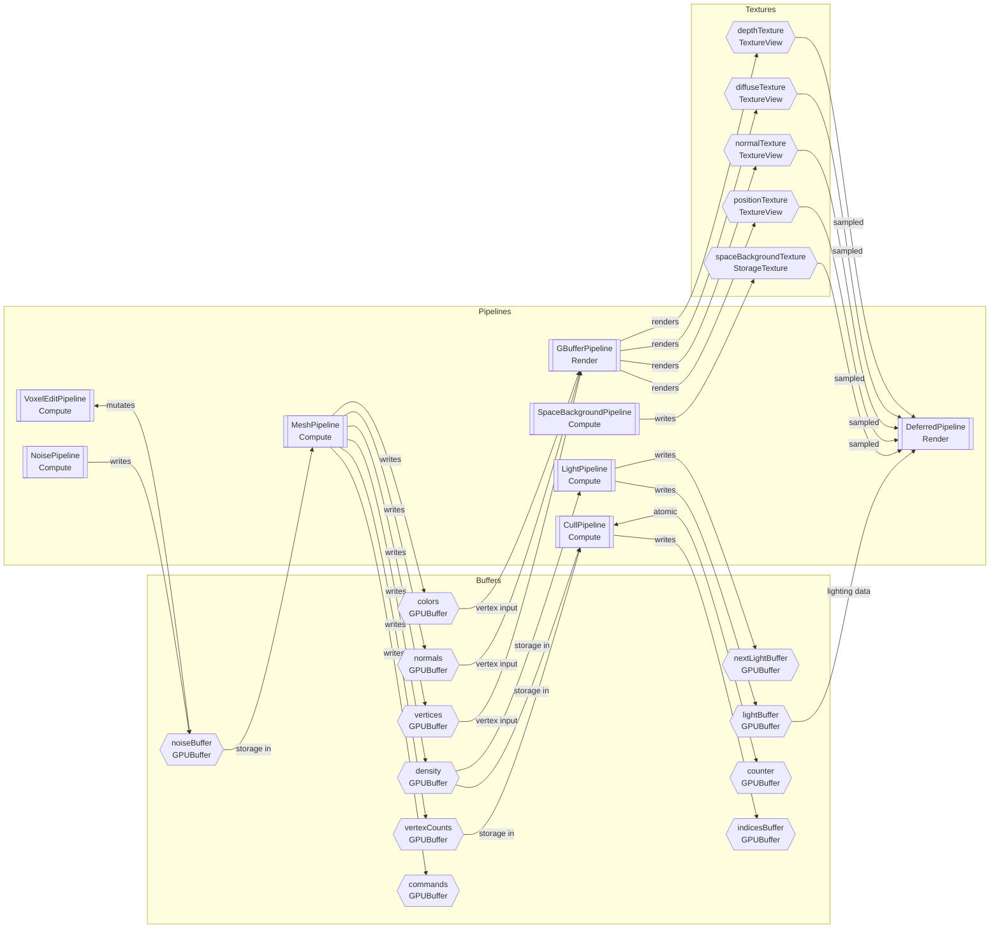

# WebGPU Buffer Relationships

This note reorganizes the `docs/bindgroups.puml` information around GPU resources so you can see who creates a buffer/texture and which pipeline later consumes it.

## Buffer & Texture Summary

| Resource | Type | Produced by | Consumed by | Notes |
| --- | --- | --- | --- | --- |
| `noiseBuffer` | GPUBuffer (storage) | `NoisePipeline` (writes noise), `VoxelEditPipeline` (mutates) | `MeshPipeline` | Central noise field shared between generation and editing.
| `vertexCounts` | GPUBuffer (storage out) | `MeshPipeline` | `CullPipeline` | Per-chunk vertex counts for indirect draw prep.
| `vertices` | GPUBuffer (storage → vertex) | `MeshPipeline` | `GBufferPipeline` | Promoted to vertex input during block G-buffer pass.
| `normals` | GPUBuffer (storage → vertex) | `MeshPipeline` | `GBufferPipeline` | Used as vertex attribute in G-buffer.
| `colors` | GPUBuffer (storage → vertex) | `MeshPipeline` | `GBufferPipeline` | Provides per-vertex color data.
| `density` | GPUBuffer (storage out) | `MeshPipeline` | `LightPipeline`, `CullPipeline` | Acts as voxel occupancy/lighting source data.
| `commands` | GPUBuffer (storage / indirect) | `MeshPipeline` | (Indirect draw encoder, not shown) | Packed indirect draw commands.
| `nextLightBuffer` | GPUBuffer (storage out) | `LightPipeline` | (Next lighting pass, not shown) | Holds frontier nodes for flood-fill.
| `lightBuffer` | GPUBuffer (storage lighting) | `LightPipeline` | `DeferredPipeline` | Double-buffered lighting results exposed via `light.getLightBuffer()`.
| `counter` | GPUBuffer (storage read/write) | `CullPipeline` | `CullPipeline` | Atomic counter used inside the cull pass.
| `indicesBuffer` | GPUBuffer (storage out) | `CullPipeline` | (Indexed draw, not shown) | Generated index list post-cull.
| `spaceBackgroundTexture` | StorageTexture | `SpaceBackgroundPipeline` | `DeferredPipeline` | Background skybox/light probe.
| `positionTexture` | TextureView (sampled) | `GBufferPipeline` | `DeferredPipeline` | G-buffer position target.
| `normalTexture` | TextureView (sampled) | `GBufferPipeline` | `DeferredPipeline` | G-buffer normal target.
| `diffuseTexture` | TextureView (sampled) | `GBufferPipeline` | `DeferredPipeline` | G-buffer albedo target.
| `depthTexture` | TextureView (sampled) | `GBufferPipeline` | `DeferredPipeline` | Captured depth for lighting/compositing.

## Resource Flow

## Shared Uniform Inputs

- `contextUniform.uniformBuffer` feeds camera/global state into almost every pipeline.
- `offsetBuffer`, `edgeTableBuffer`, `triangleTableBuffer`, `editParamsBuffer`, and `configBuffer` are CPU-authored uniforms referenced where noted in the original bind groups but omitted from the flow diagram for clarity.

> [!tip]
> Use Obsidian’s Mermaid preview to pan/zoom the graph when the buffer list grows; it helps keep long resource names legible.
